# LOAD BALANCER SOLUTION WITH APACHE

## INTRODUCTION

This project is a continuation of our devops tooling website project and aims is to create one single point of access with a single Address/Name for the web servers using a **Load Balancer**.
Typically, we use URLs to access websites on the Internet. From the perspective of a client, as long as the URL takes you to the page you aim to go, you are fine. Meanwhile, there are lot of complexities built into the architecture of websites, particularly those visited by millions of client daily. Such websites make use of horizontal scaling which involves the distributing load across multiple Web servers. This approach is often seamlessly applicable with seemingly boundless number of Web servers.   
The property of a system's capability to handle growing load by adding extra resources is called **SCALABILITY**.

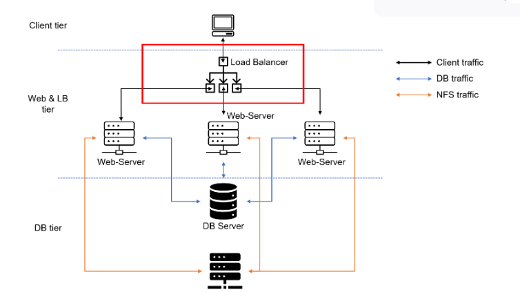

This project utilizes a portion of the earlier project and a few additions:
* Two RHEL8 Web Servers
* One MySQL DB Server (Ubuntu Server 20.04)
* One RHEL NFS server

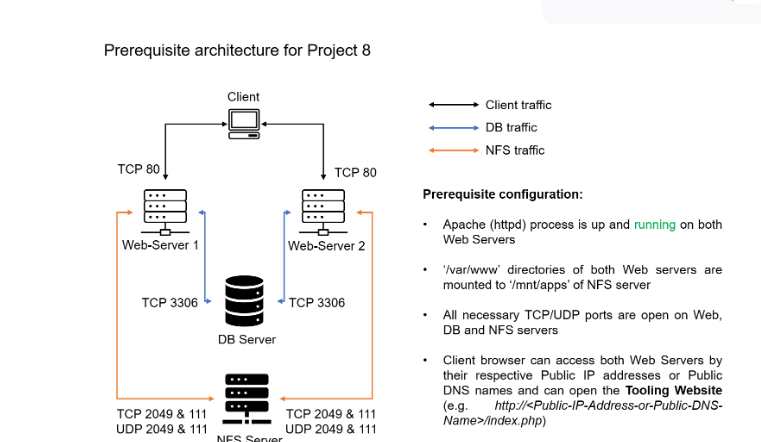


## CONFIGURING LOAD BALANCER USING APACHE

I created an Ubuntu Server 20.04 EC2 instance and named it Project8-ApacheLb and opened up the TCP port 80 and activated the other required components.

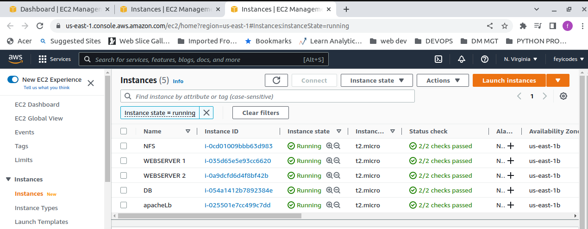

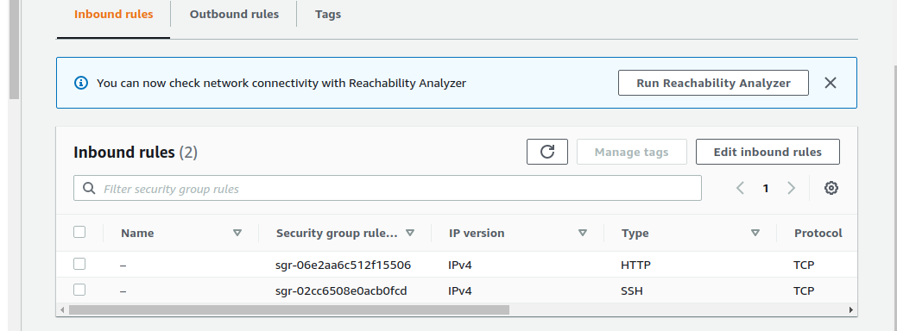

I installed Apache and other dependencies on Project8-ApacheLb and created the necessary configurations using the following commands:
```bash
    #Install apache2
    sudo apt update
    sudo apt install apache2 -y
    sudo apt-get install libxml2-dev
```
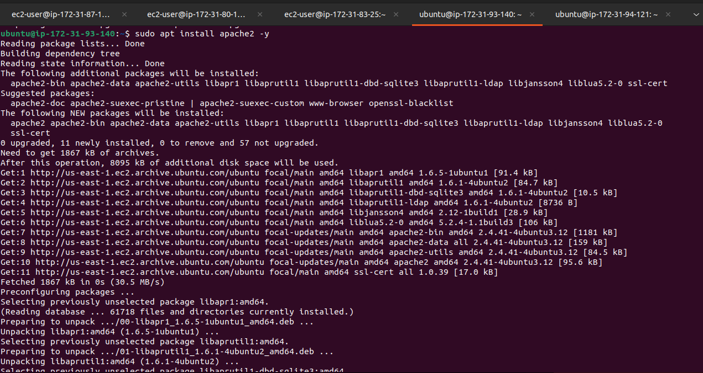

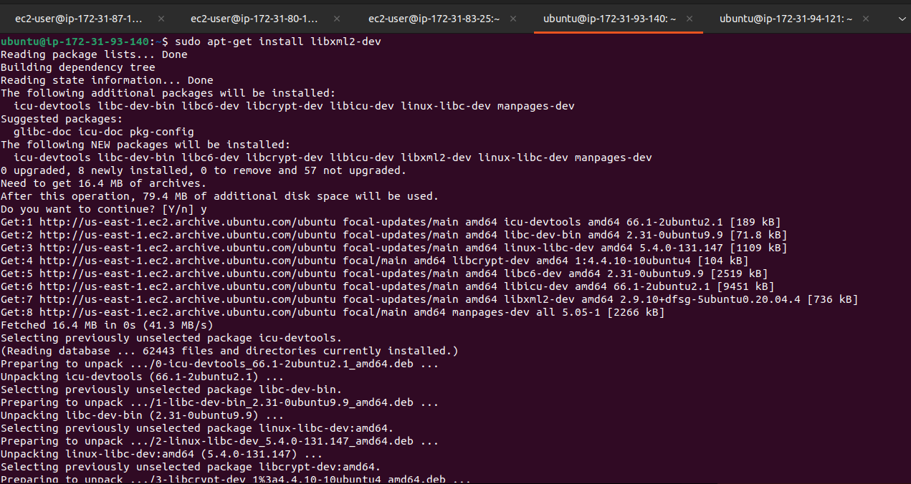


I enabled the necessary modules:
```bash
    sudo a2enmod rewrite
    sudo a2enmod proxy
    sudo a2enmod proxy_balancer
    sudo a2enmod proxy_http
    sudo a2enmod headers
    sudo a2enmod lbmethod_bytraffic
```
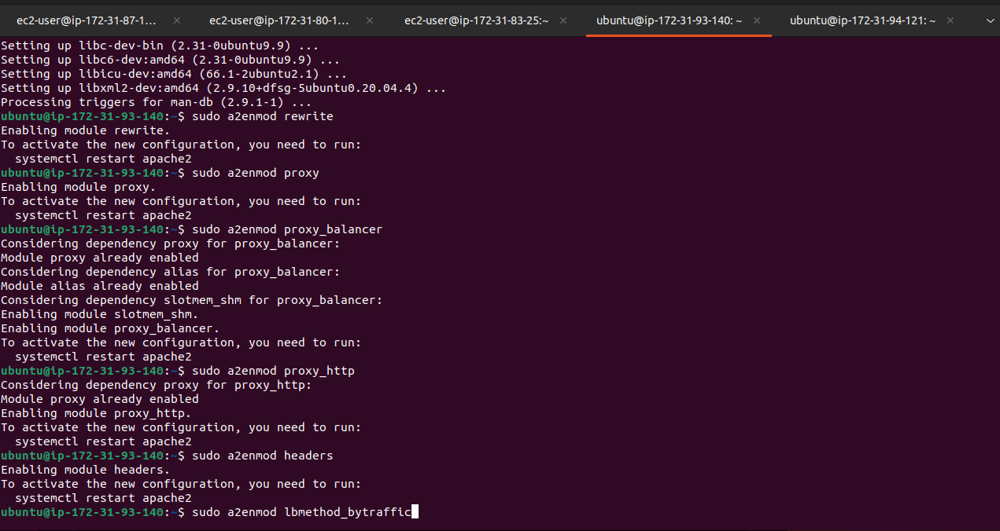

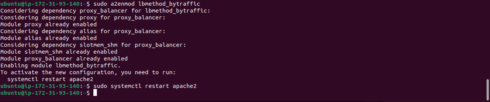

and setup apache to make sure it is working

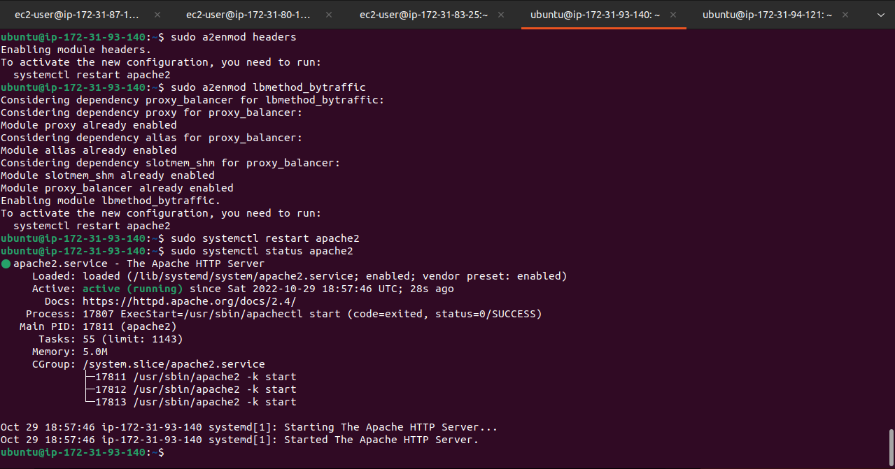

I set up its configuration to ensure that all traffic coming to it point to both web servers using the following commands:

```bash
sudo vi /etc/apache2/sites-available/000-default.conf

#Add this configuration into this section <VirtualHost *:80>  </VirtualHost>

<Proxy "balancer://mycluster">
               BalancerMember http://<WebServer1-Private-IP-Address>:80 loadfactor=5 timeout=1
               BalancerMember http://<WebServer2-Private-IP-Address>:80 loadfactor=5 timeout=1
               ProxySet lbmethod=bytraffic
               # ProxySet lbmethod=byrequests
        </Proxy>

        ProxyPreserveHost On
        ProxyPass / balancer://mycluster/
        ProxyPassReverse / balancer://mycluster/

#Restart apache server

sudo systemctl restart apache2
```

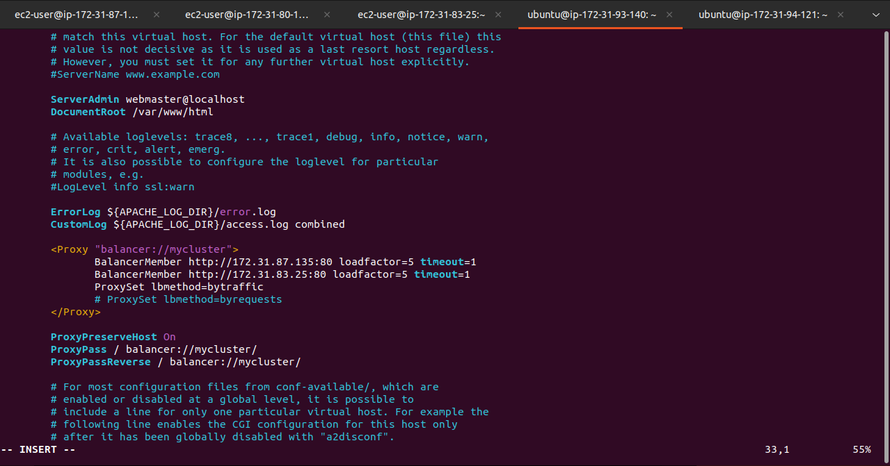

I verified the configuration works after accessing the Load Balancer IP address via my browser.


In the earlier project (project7), I had mounted /var/log/httpd/ from my web server unto the NFS server, so I had to unmount them.
In order to this, I stopped the apache instance on the web server and edited /etc/fstab and deleted the line informing the system of the configuration.


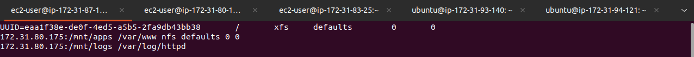

I unmounted it using the following command:
```bash
    sudo unmount -f /var/log/httpd
```
I restarted apache afterwards. 

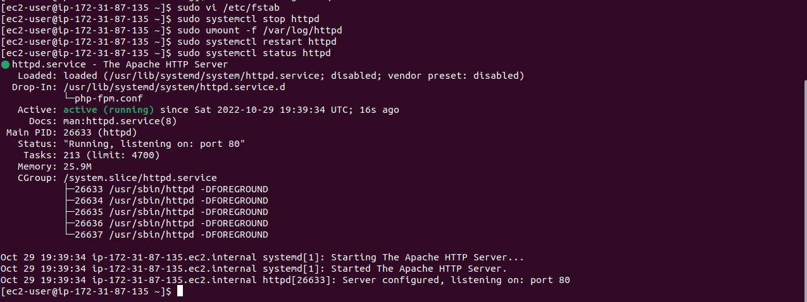

I refreshed my browser on a few occasions and checked each server's log file to confirm it received the HTTP GET requests sent in via the load balancer.

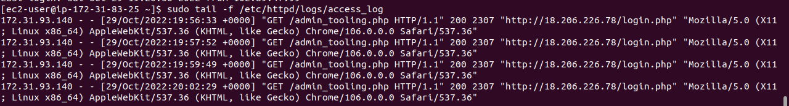

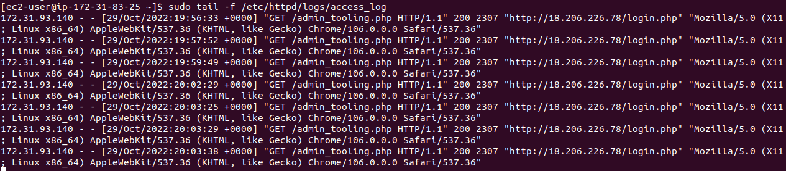

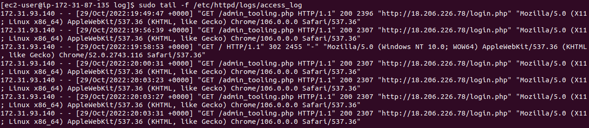

I confirmed that the load balancer evenly distributed the traffic since after 14 visits to the LB address, the first and second web servers had 7 GET Requests each.

I also configured the local DNS names resolution on the load balancer in order to understand how we can rename each server locally in order to ease managment in a scenario where you might have hundreds of web servers.

First, I opened /etc/hosts on my Project8-ApacheLb and added the records of the local IP Address and Abritary names generated.

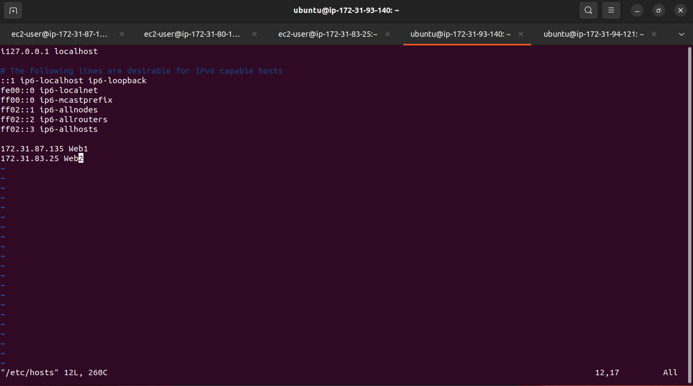

I curled the web server locally using 

```bash
    curl http://Web1
    curl http://Web2
```
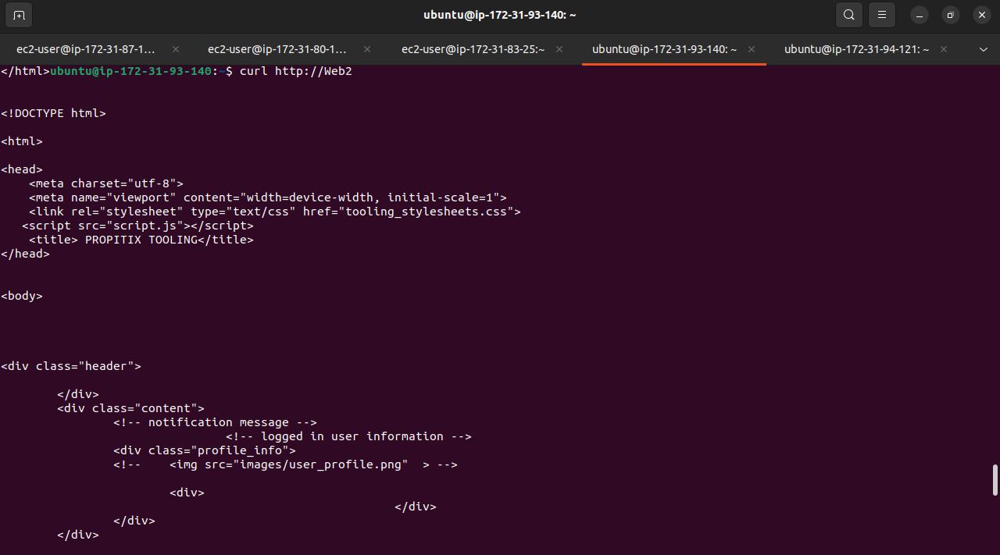

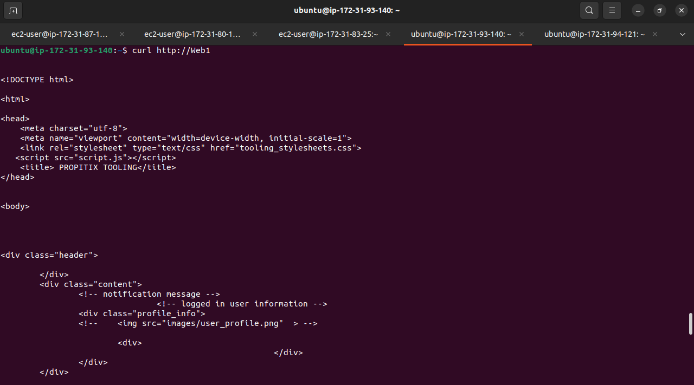

I also updated the LB config file with the arbitrary names instead of the IP addresses

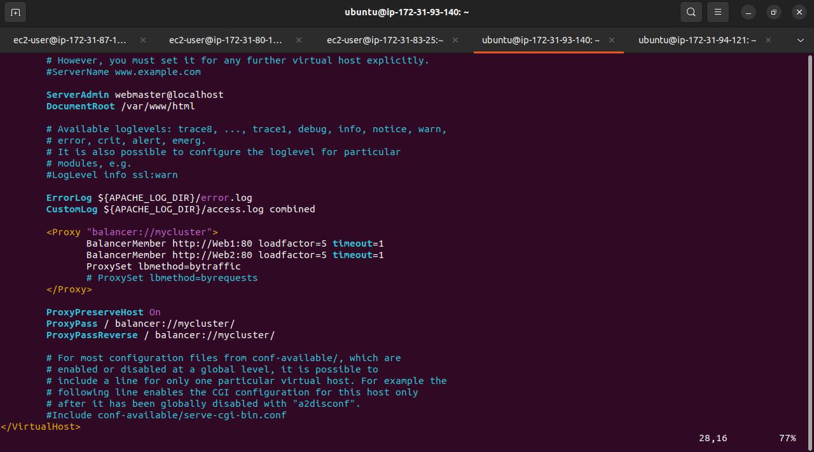

And successfully communicated with the web server via the arbitrary name.

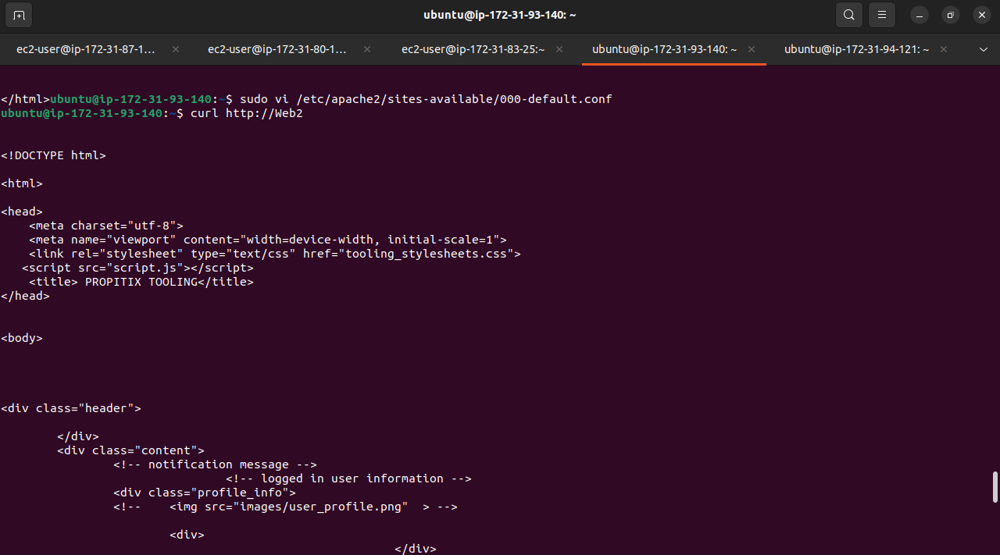

Hence our architecture takes the form shown below:

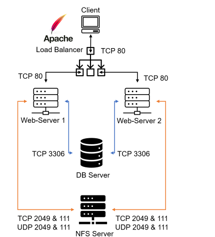
